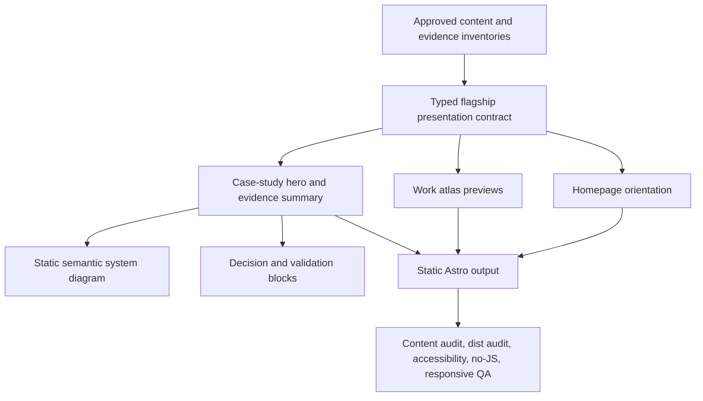

# Public AI Systems Portfolio Impact Upgrade

## Goal Capsule

- **Objective:** Turn the implemented V1 from a polished documentation-style portfolio into an artifact-led experience that makes the quality of the systems immediately visible, memorable, and worth exploring.
- **Primary audience:** Hiring managers, technical leaders, prospective collaborators, and partners evaluating systems judgment, product thinking, and implementation depth.
- **Baseline:** Treat the current uncommitted copy refinements as accepted working-tree input. Preserve them and build the presentation upgrade around them rather than rewriting the same content again.
- **Authority:** Current user direction, `AGENTS.md`, the approved design specification, the public-review matrix, evidence inventories, and current repository behavior, in that order.
- **Success shape:** A visitor can understand the practice in 30 seconds, see one distinctive technical artifact per flagship system within five minutes, and enter a substantial case-study path without encountering generic portfolio theater.
- **Stop conditions:** Stop for explicit user review before publishing any new screenshot, video, demo capture, metric, source link, employer/history statement, local-only implementation detail, or additional project. Native diagrams and presentation derived entirely from already-approved narratives do not require a new claim decision.
- **Tail ownership:** Implementation owns local verification and browser evidence only. Do not push, open a pull request, merge, deploy, or change hosting without a separate request.

---

## Product Contract

### Summary

The V1 has strong structure, careful language, and reliable publication controls, but the rendered experience asks visitors to read before it gives them something memorable to see. The homepage uses one visual treatment for nearly every card, the hero has no signature artifact, and the case studies remain narrow text columns with diagrams that read more like structured documentation than designed system explanations.

The upgrade should make the work feel specific without becoming louder or less credible. The highest-leverage move is not a broad restyle. It is to expose the artifacts already implicit in the approved evidence: lifecycle boundaries, recovery loops, evidence gates, validation states, and deliberate limitations.

### Problem Frame

The current site successfully answers “is this thoughtful and professional?” It is less effective at answering “what will I remember about Andy’s work tomorrow?” The answer is presently buried in prose:

- Chief of Staff separates coordination from runtime, memory, and repository authority.
- LifeOS treats interruption recovery and re-entry as core product behavior.
- Alpha Screener exposes uncertainty and blocks unsupported promotion from research to action.

Those are distinctive systems ideas. The presentation should make each one visible above the fold and repeat that identity consistently through the homepage, project atlas, and case studies.

### Requirements

#### Immediate impression

- R1. Preserve the approved headline “Software that strengthens human capability.” while making Andy’s identity and systems practice explicit in the first viewport.
- R2. Add one static, meaningful portfolio-level visual to the homepage hero that introduces the three flagship concerns: authority, continuity, and evidence.
- R3. Use one unambiguous homepage primary action, “Explore the flagship systems,” linking to `/case-studies/`; keep the handbook and contact routes visibly secondary.
- R4. Derive any displayed content counts from public collection queries; do not hard-code counts or present them as adoption/performance metrics.

#### Distinctive flagship presentation

- R5. Give Chief of Staff, LifeOS, and Alpha Screener distinct but related visual identities using controlled theme tokens, diagram grammar, and artifact previews.
- R6. Give each flagship preview a project-specific hook, one pivotal decision, one validation boundary, and a direct case-study path.
- R7. Keep the visual identities recognizable without changing the shared dark design system or turning the site into three unrelated microsites.
- R8. Use only approved narrative and validation evidence. Visual prominence must never upgrade “inspected,” “fixture-tested,” or “not yet validated” evidence into a stronger claim.

#### Artifact-led case studies

- R9. On desktop, make the first case-study viewport answer four questions: what problem matters, what the system changes, what evidence currently exists, and what remains unproven. On mobile, answer them in the prioritized opening sequence before the first long-form H2 rather than compressing everything into one literal viewport.
- R10. Upgrade system diagrams from equal-weight boxes plus edge text into readable, project-specific flows with visible direction, boundaries, and human decision points.
- R11. Preserve a complete semantic text equivalent for every diagram and all no-JavaScript reading behavior.
- R12. Add reusable presentation for decisions, validation evidence, limitations, and next steps without duplicating the prose as decorative cards.
- R13. Keep the approved case-study sections and their meaning: What it solves, System design, Key decisions and tradeoffs, Validation, Human value, and What comes next.

#### Project atlas and navigation

- R14. Make Work cards distinguish systems by job, artifact, and maturity rather than title, status, and capability tags alone.
- R15. Keep all five reviewed public projects visible before JavaScript and preserve the existing accessible capability filter as progressive enhancement.
- R16. Improve desktop navigation legibility and mobile hierarchy without hiding primary routes behind JavaScript-dependent controls.

#### Evidence and publication safety

- R17. Add a typed presentation contract, canonically owned by the project entry. All five public projects receive a short Work hook, visual mark, and technical differentiator; the three flagships additionally receive a distinct case-study hook, theme, artifact labels, pivotal decision, evidence method/state/scope, and diagram configuration. Public UI must not depend on page-local duplicated strings.
- R18. Extend content auditing to scan every new public presentation field for sanitizer risks. Enforce evidence method and state through the typed schema rather than heuristic prose policing.
- R19. Keep `visibility`, `publicReview`, and `sourceAvailability` independent and unchanged unless the user explicitly approves a publication decision.
- R20. Do not add screenshots, videos, animated captures, external demo embeds, or media-review infrastructure in this upgrade. A future media plan must keep private provenance in an ignored local registry and expose only public-safe approval metadata.

#### Quality

- R21. Core routes, visuals, labels, and calls to action must remain usable without client JavaScript.
- R22. Preserve one `<h1>`, landmarks, keyboard navigation, reduced-motion behavior, useful text alternatives, minimum 44-by-44 CSS-pixel touch targets for interactive controls, and no horizontal overflow at 375, 768, 1280, and 1536 pixels.
- R23. The distribution audit must continue to reject private paths, local/private URLs, secret-like text, draft/internal markers, broken links, and missing media.
- R24. The upgrade must pass the existing complete V1 verification gate plus focused tests for the new presentation contracts and routes.

### Actors

- A1. A hiring manager scanning for a memorable signal of technical judgment in under a minute.
- A2. A technical reviewer reading a case study deeply enough to test the architecture, tradeoffs, and validation claims.
- A3. A collaborator looking for shared interests and a concrete reason to start a conversation.
- A4. Andy reviewing whether a public artifact accurately represents the work and is safe to publish.

### Key Flows

- F1. Thirty-second orientation
  - **Trigger:** A1 lands on the homepage.
  - **Steps:** Read the positioning, recognize the three flagship system concerns, inspect one visual artifact, choose a flagship or methods path.
  - **Outcome:** The visitor can state what Andy builds and name at least one distinctive system idea without scrolling through the whole page.
  - **Covers:** R1-R7.
- F2. Five-minute evidence scan
  - **Trigger:** A1 or A2 opens a flagship case study.
  - **Steps:** Read the hook, scan the system flow, inspect the pivotal decision and validation boundary, then decide whether to continue into the full narrative or source.
  - **Outcome:** The visitor sees engineering judgment and evidence limits before encountering long-form prose.
  - **Covers:** R8-R13.
- F3. Work comparison
  - **Trigger:** A1 visits Work or follows a homepage card.
  - **Steps:** Compare systems by job and maturity, optionally filter by capability, open a project or case study.
  - **Outcome:** Breadth reinforces the AI-systems position instead of flattening every project into the same card.
  - **Covers:** R14-R16, R21.

### Acceptance Examples

- AE1. Given the homepage at 1280 pixels, when a first-time visitor views the first screen, then the headline, Andy’s practice, flagship visual, and primary flagship CTA are visible without requiring animation or interaction.
- AE2. Given JavaScript disabled, when a visitor opens the homepage and each flagship case study, then all visual labels, evidence summaries, decisions, limitations, and navigation remain readable and reachable.
- AE3. Given the Chief of Staff case study, when a visitor scans the first viewport and diagram, then repository authority and runtime authority remain visibly separate and no repository link or private operational detail appears.
- AE4. Given LifeOS, when a visitor scans its artifact preview, then the visual emphasizes interruption, preserved context, and re-entry rather than clinical or productivity claims.
- AE5. Given Alpha Screener, when a visitor scans its evidence view, then uncertainty and promotion gates are more prominent than any ranked result and no investment-performance implication is introduced.
- AE6. Given widths 375, 768, 1280, and 1536, when the hero, flagship grid, Work atlas, and case studies render, then primary actions remain visible, diagrams remain understandable, and the document has no horizontal overflow.

### Scope Boundaries

#### Included

- Homepage hero, featured-system presentation, and calls to action.
- Shared visual tokens and flagship presentation contracts.
- Work-card hierarchy and flagship artifact previews.
- Case-study hero, evidence summary, diagrams, decision/validation blocks, and long-form layout.
- Focused unit, content-audit, browser, accessibility, no-JavaScript, and responsive coverage.

#### Deferred until separate approval

- Publishing screenshots, videos, demo recordings, or new external embeds.
- Promoting any draft project or adding a new flagship/case study.
- Adding quantitative performance, adoption, customer, reliability, or business-impact claims.
- Publishing Chief of Staff source or local-only repository details.

#### Outside this upgrade

- A new framework, CMS, database, analytics stack, authentication system, or runtime backend.
- A light theme, 3D effects, ornamental WebGL, fake terminals, skill bars, or dashboard-style vanity metrics.
- A full brand replacement, autobiographical rewrite, or invented employment narrative.
- Hosting, domain, deployment, or search-marketing work.

This is intentionally a local pre-public enhancement. Hosting and domain selection remain the next separate product decision; completing this plan must not be described as audience reach or public launch.

---

## Planning Contract

### Key Technical Decisions

- KTD1. Artifact-first, not redesign-first. Preserve the existing information architecture, dark palette, and static architecture. Spend design effort on system artifacts, evidence hierarchy, and flagship differentiation rather than replacing every shared component.
- KTD2. Static visual grammar. Build diagrams with semantic HTML and inline SVG/CSS generated at build time. The visible semantic text is the accessibility and no-JavaScript authority; duplicate SVG labels and geometry are `aria-hidden` so each relationship is announced once. At 768 pixels and below, diagrams reflow into an ordered vertical sequence that preserves logical edge order without internal scrolling.
- KTD3. Project-owned flagship presentation data. The project entry is the canonical owner of visual theme, route-specific short hooks (`workHook` and, for flagships, `caseStudyHook`), pivotal decision, evidence summary, and diagram configuration. Homepage and Work read it directly; case-study routes resolve it through `projectId`. Case-study MDX owns only the long-form narrative and component placement.
- KTD4. Evidence method, state, and scope are explicit. Use `evidenceMethod` values `test-execution`, `static-check`, `source-inspection`, or `none`; `evidenceState` values `validated-within-scope`, `inspected-only`, or `not-yet-validated`; and a required factual scope string such as “deterministic offline fixtures” or “focused uncertainty and readiness rules.” Enforce compatible method/state pairs in the schema. The combination states what actually ran or was inspected without inferring publication approval, system maturity, or end-to-end validation.
- KTD5. Three related visual identities. Use shared primitives with project-specific emphasis: authority/lifecycle for Chief of Staff, continuity/re-entry for LifeOS, and evidence/promotion gates for Alpha Screener. Keep typography, spacing, border language, and interaction behavior shared.
- KTD6. Rich media is deferred. Native diagrams ship from approved narrative. Screenshots and video require a separate follow-on plan after explicit user approval to evaluate candidate assets; no media registry or rendering infrastructure is part of this core upgrade.
- KTD7. Progressive enhancement stays narrow. Do not add a general client-side animation system. Optional diagram focus or subtle entrance transitions may hydrate only when they improve comprehension and must disappear under reduced motion.
- KTD8. Visual verification is part of the contract. Automated assertions protect semantics and overflow; final browser evidence compares the homepage, Work, and one flagship case study at mobile and desktop sizes. Screenshot evidence documents the release but is not a brittle pixel-perfect test.

### Architecture

### Existing Patterns to Preserve

- Publication selection remains in `src/lib/content/publication.ts` and `src/lib/content/queries.ts`.
- Controlled capability vocabulary remains in `src/lib/content/taxonomy.ts`.
- Global design values remain in `src/styles/tokens.css`; new project accents extend tokens instead of appearing as page-local hex values.
- `MediaFigure.astro` remains the required accessibility boundary for approved raster media.
- `SystemDiagram.astro` retains a semantic text representation and becomes a stronger visual renderer rather than a canvas-only replacement.
- `DecisionBlock.astro` remains the shared vocabulary for decision, tradeoff, validation, limitation, and next-step presentation.
- Existing Playwright route, accessibility, no-JavaScript, and responsive suites are extended rather than duplicated.

### Sequencing

Before editing, record the current scoped diff for the homepage, project entries, case studies, and filter component. Treat those uncommitted refinements as baseline input and reconcile around them rather than restoring from `HEAD`.

1. Lock the presentation/evidence contract and audit behavior before adding UI that consumes it.
2. Build shared visual primitives and the three flagship diagram configurations.
3. Upgrade the case-study first viewport, because it establishes the artifact language the homepage and Work cards will preview.
4. Recompose the homepage around those real artifacts rather than designing decorative placeholders.
5. Improve the Work atlas and navigation hierarchy using the same presentation data.
6. Finish with cross-route browser polish and a new readiness record.

### Risks and Mitigations

| Risk | Mitigation |
|---|---|
| Visual polish implies stronger evidence than exists | Every visual evidence item carries an explicit basis; limitations remain adjacent to validation. |
| Three project identities fragment the design system | Shared layout, typography, spacing, and component APIs; only controlled accents and diagram grammar vary. |
| The homepage becomes crowded | Keep one flagship visual in the hero, three compact previews, and preserve the approved section order. |
| Case studies become card walls | Use cards only for the first-view summary and consequential decisions; long-form explanation remains editorial prose. |
| Diagrams become inaccessible | Keep semantic node/relationship text, test reading order, and verify no-JavaScript behavior. |
| Media leaks private or personal data | Keep screenshots and video out of this upgrade; require a separate approved media plan before introducing any asset. |
| Motion weakens performance or usability | Static-first output, no required animation, reduced-motion coverage, and no broad runtime animation dependency. |
| Current copy refinements are overwritten | Treat the working tree as baseline, inspect diffs before each unit, and avoid restoring files from `HEAD`. |

---

## Implementation Units

### U1. Add typed project presentation and evidence contracts

- **Goal:** Establish one auditable source for project hooks, visual identity, and flagship evidence basis.
- **Requirements:** R8, R17-R19, R23.
- **Files:**
  - Modify `src/content.config.ts`.
  - Create `src/lib/content/presentation.ts`.
  - Modify `src/lib/content/types.ts`.
  - Modify `scripts/audit-public-content.ts`.
  - Modify all five public entries under `src/content/projects/` as the canonical presentation-data owners; only the three flagships require artifact and evidence fields. Keep case-study presentation joins keyed by the existing `projectId` rather than duplicating fields under `src/content/case-studies/`.
  - Create `tests/unit/presentation.test.ts`.
  - Modify `tests/unit/audit-public-content.test.ts`.
- **Approach:** Add required `workHook`, `visualMark`, and `technicalDifferentiator` fields for every public project, plus controlled flagship fields for `caseStudyHook`, theme, pivotal decision, evidence summary, and diagram configuration. Evidence summaries contain the enumerated `evidenceMethod`, enumerated `evidenceState`, and required factual `evidenceScope`; schema validation owns those semantics and compatible pairs. The audit scans every new public string only for the existing sanitizer risks and does not attempt heuristic claim-strength policing.
- **Test scenarios:**
  - A featured flagship with complete approved presentation data validates.
  - An evidence item with an unknown method/state, incompatible pair, or empty evidence scope fails schema validation.
  - A local-only project remains publishable without source or media links when its existing review is approved.
  - A sanitizer pattern placed in a new presentation field fails the content audit.
  - Draft/internal content remains excluded regardless of presentation completeness.
- **Verification:** `npm test -- tests/unit/presentation.test.ts tests/unit/audit-public-content.test.ts`; `npm run audit:content`; `npm run check`.

### U2. Build the flagship visual language and semantic diagrams

- **Goal:** Create the shared visual primitives that make the three flagship systems recognizable and technically legible.
- **Requirements:** R5-R13, R21-R22.
- **Files:**
  - Modify `src/styles/tokens.css`.
  - Modify `src/styles/global.css`.
  - Refactor `src/components/diagrams/SystemDiagram.astro`.
  - Modify `src/components/content/DecisionBlock.astro`.
  - Create `tests/unit/flagship-presentation.test.ts` for pure presentation mapping or helpers.
  - Modify `tests/e2e/accessibility.spec.ts` and `tests/e2e/no-javascript.spec.ts`.
- **Approach:** Extend the shared token system with three restrained flagship accents and semantic state tokens. First extend `SystemDiagram.astro` and `DecisionBlock.astro`; extract another primitive only after a concrete second consumer proves it removes meaningful duplication. Render directional diagrams as static HTML/SVG with a real flow hierarchy, visible boundaries, and human-decision nodes. Keep node/component/relationship prose available once in DOM reading order and hide duplicate SVG labels from assistive technology. At 768 pixels and below, replace the spatial graph with an ordered vertical flow that preserves relationship order and avoids an internally scrolling diagram. Use the same primitives for compact homepage artifacts and full case-study diagrams.
- **Test scenarios:**
  - Each flagship resolves to one controlled visual theme and diagram configuration.
  - Every visual diagram has an accessible title, description, and complete text equivalent, with each relationship announced once.
  - Arrow direction and edge labels are not the only way relationships are conveyed.
  - Diagram content is present with JavaScript disabled.
  - Reduced-motion mode removes optional transitions without hiding state.
  - Mobile diagrams reflow in logical edge order, stay within the viewport, retain readable labels, and do not introduce internal scrolling.
- **Verification:** `npm test -- tests/unit/flagship-presentation.test.ts`; `npm run test:e2e -- tests/e2e/accessibility.spec.ts tests/e2e/no-javascript.spec.ts tests/e2e/responsive.spec.ts`.

### U3. Turn flagship case studies into artifact-led technical stories

- **Goal:** Make each flagship persuasive in its first viewport while preserving its full evidence-led narrative.
- **Requirements:** R5-R13, R21-R24; AE2-AE5.
- **Files:**
  - Modify `src/layouts/ArticleLayout.astro` to support a wider case-study variant without changing handbook/signal prose widths.
  - Create `src/components/content/CaseStudyHero.astro`.
  - Modify `src/pages/case-studies/[slug].astro`.
  - Modify the three approved files under `src/content/case-studies/` to place the shared components without changing claim meaning.
  - Modify `src/styles/prose.css` only where long-form rhythm and responsive artifact width require shared behavior.
  - Modify `tests/e2e/routes.spec.ts`, `tests/e2e/accessibility.spec.ts`, and `tests/e2e/responsive.spec.ts`.
- **Approach:** Add one shared case-study hero with a project-specific hook and compact at-a-glance summary, then render the flagship diagram before the long-form sections. Keep decision and validation labels adjacent to their evidence basis. Use a wider artifact region while preserving a comfortable prose measure. On desktop, compose these elements within the first viewport; on mobile, preserve their priority before the first long-form H2. Omit a table of contents in this upgrade so it cannot duplicate the at-a-glance summary.
- **Test scenarios:**
  - Each flagship desktop first viewport contains a hook, problem, pivotal decision, validation basis, and limitation; mobile presents the same sequence before the first long-form H2.
  - All six approved H2 sections remain present exactly once.
  - Chief of Staff has no source link, private path, private URL, or live-fleet implication.
  - LifeOS contains no personal data or clinical/productivity claim.
  - Alpha Screener foregrounds uncertainty and contains no investment-advice or performance implication.
  - The case-study layout has one H1, valid landmarks, no axe violations, and no horizontal overflow at all supported widths.
- **Verification:** `npm run audit:content`; `npm run check`; `npm run test:e2e -- tests/e2e/routes.spec.ts tests/e2e/accessibility.spec.ts tests/e2e/responsive.spec.ts tests/e2e/no-javascript.spec.ts`.

### U4. Recompose the homepage as a 30-second technical tour

- **Goal:** Make the homepage immediately memorable using the real flagship artifacts developed in U2-U3.
- **Requirements:** R1-R8, R21-R24; AE1-AE2.
- **Files:**
  - Modify `src/pages/index.astro` while preserving the current uncommitted content refinements.
  - Modify `src/components/content/ProjectCard.astro` only if a reusable static artifact-preview variant is needed by both Home and another server-rendered route.
  - Modify `tests/e2e/homepage.spec.ts`, `tests/e2e/accessibility.spec.ts`, and `tests/e2e/responsive.spec.ts`.
- **Approach:** Compose the hero directly in `index.astro` using the compact `SystemDiagram.astro` variant: positioning and the primary `/case-studies/` action first, followed by a static visual connecting authority, continuity, and evidence to human-owned decisions. Keep handbook and contact as secondary actions. Replace uniform featured cards with three artifact previews driven by the typed presentation data, extending `ProjectCard.astro` only if a second server-rendered consumer justifies the abstraction. Keep the approved homepage section order and let the Signal Library remain the secondary violet centerpiece.
- **Test scenarios:**
  - The approved H1 and section order remain unchanged.
  - Andy’s practice, the flagship visual, and primary CTA appear in the desktop first viewport.
  - The three featured systems retain their approved order and direct case-study paths.
  - Derived public counts, if rendered, match collection queries and exclude drafts.
  - The homepage remains complete without JavaScript and under reduced motion.
  - Mobile content order puts positioning and the `/case-studies/` CTA before the visual, preserves 44-by-44 CSS-pixel interactive targets, and avoids clipped labels.
- **Verification:** `npm run test:e2e -- tests/e2e/homepage.spec.ts tests/e2e/accessibility.spec.ts tests/e2e/responsive.spec.ts tests/e2e/no-javascript.spec.ts`; browser capture at 375x812 and 1280x720.

### U5. Increase differentiation and scan quality in Work and navigation

- **Goal:** Let visitors compare the five public projects by purpose, technical idea, and evidence maturity without weakening filtering or route safety.
- **Requirements:** R14-R16, R19, R21-R24; AE6.
- **Files:**
  - Modify `src/components/interactive/ProjectFilter.tsx` and `src/components/interactive/ProjectFilter.css`.
  - Modify `src/pages/work/index.astro` only if server-rendered presentation data needs shaping before hydration.
  - Modify `src/components/layout/SiteHeader.astro`.
  - Modify `tests/components/project-filter.test.tsx`.
  - Modify `tests/e2e/work-filter.spec.ts`, `tests/e2e/no-javascript.spec.ts`, and `tests/e2e/responsive.spec.ts`.
- **Approach:** Add a compact project-specific visual mark and one technical differentiator to each Work card. Convert raw lifecycle labels into clear display copy without changing underlying status. Improve header scale, spacing, and active-state prominence; preserve a fully visible, wrapping static navigation rather than introducing a JavaScript menu in V1.
- **Test scenarios:**
  - All five public projects render before hydration and each has a distinct hook.
  - Capability filtering, result count, clear behavior, keyboard operation, and unchanged URL still pass.
  - Draft projects never appear in static HTML or hydrated results.
  - Header navigation remains operable at 375 pixels without document overflow.
  - Active-route state remains correctly announced and visible.
- **Verification:** `npm test -- tests/components/project-filter.test.tsx`; `npm run test:e2e -- tests/e2e/work-filter.spec.ts tests/e2e/no-javascript.spec.ts tests/e2e/responsive.spec.ts`.

### U6. Perform cross-route visual QA and record impact readiness

- **Goal:** Verify that the upgrade feels coherent and impressive in a real browser while preserving every V1 safety and accessibility gate.
- **Requirements:** R21-R24.
- **Files:**
  - Modify only files implicated by observed defects.
  - Create `docs/verification/portfolio-impact-readiness.md`.
- **Approach:** Run the complete automated gate, then inspect Home, Work, and all three flagship case studies at mobile and desktop sizes. Compare the new screenshots with the planning baseline for hierarchy, differentiation, artifact clarity, reading rhythm, and CTA prominence. Record exact routes, viewports, commands, remaining limitations, and deferred approval decisions.
- **Test scenarios:**
  - No route regresses publication, metadata, accessibility, no-JavaScript, responsive, or internal-link behavior.
  - A 30-second browser scan surfaces the positioning, all three flagship concerns, and a primary case-study path.
  - A five-minute case-study scan exposes one system artifact, one pivotal decision, one validation basis, and one limitation before deep reading.
  - No console errors, broken assets, missing links, or sanitizer findings appear in dev or preview output.
- **Verification:** `npm run verify`; `git diff --check`; smoke-test the development and production-preview artifacts at exact reported URLs; capture Home and one flagship at 375x812 and 1280x720.

---

## Verification Contract

| Gate | Command or evidence | Applies to |
|---|---|---|
| Presentation unit contracts | `npm test -- tests/unit/presentation.test.ts tests/unit/flagship-presentation.test.ts` | U1-U2 |
| Component behavior | `npm test -- tests/components/project-filter.test.tsx` | U5 |
| Content and sanitization | `npm run audit:content` | U1, U3, U6 |
| Type and Astro validation | `npm run check` | All code-bearing units |
| Static build and output audit | `npm run build` | U1-U6 |
| Route and publication behavior | `npm run test:e2e -- tests/e2e/routes.spec.ts` | U3, U6 |
| Homepage narrative | `npm run test:e2e -- tests/e2e/homepage.spec.ts` | U4 |
| Filtering | `npm run test:e2e -- tests/e2e/work-filter.spec.ts` | U5 |
| Accessibility and reduced motion | `npm run test:e2e -- tests/e2e/accessibility.spec.ts` | U2-U6 |
| No-JavaScript behavior | `npm run test:e2e -- tests/e2e/no-javascript.spec.ts` | U2-U6 |
| Responsive behavior | `npm run test:e2e -- tests/e2e/responsive.spec.ts` | U2-U6 |
| Complete release gate | `npm run verify` | U6 |
| Visual evidence | Browser captures at 375x812 and 1280x720 for Home, Work, and one flagship case study | U4-U6 |
| Diff hygiene | `git diff --check` and scoped `git status --short --branch` review | U6 |

Testing strategy: U1-U2 use proof-first tests for new contracts and failure behavior. U3-U5 strengthen existing browser/component tests before changing user-visible structure. Purely visual changes use before/after browser evidence plus the full semantic and responsive gate rather than brittle pixel snapshots.

---

## Definition of Done

- The homepage first viewport identifies Andy’s practice, presents one meaningful portfolio visual, and offers a direct flagship path.
- Chief of Staff, LifeOS, and Alpha Screener are visually distinct through shared, controlled design primitives rather than one-off styling.
- Each flagship case study exposes its problem, pivotal decision, evidence basis, limitation, and system artifact within the desktop first viewport and before the first long-form H2 on mobile.
- The Work atlas differentiates all five public projects without hiding content behind JavaScript.
- Every diagram retains one authoritative semantic text equivalent, announces each relationship once, reflows into logical order on mobile, and passes accessibility/no-JavaScript checks.
- No publication state, source availability, project scope, source link, or claim strength changes without explicit approval.
- No unapproved media reaches a public route or generated output.
- `npm run verify` passes, including unit, component, content, build, distribution, route, accessibility, no-JavaScript, and responsive coverage.
- Development and production-preview artifacts are smoke-tested, and the exact verified URLs are recorded in `docs/verification/portfolio-impact-readiness.md` while the processes remain running for handoff.
- The final handoff includes before/after screenshots, a concise explanation of the three flagship visual identities, known limitations, and every remaining human approval decision.
- The final handoff distinguishes technical/presentation readiness from unvalidated audience comprehension and identifies hosting/domain selection as a separate next product decision.

---

## Appendix

### Planning Baseline

The current browser inspection found:

- The dark system is coherent and readable, with strong type hierarchy and clean section rhythm.
- The hero has substantial empty space but no visual artifact or explicit “Andy builds…” identity line.
- Homepage cards and case-study callouts repeat one rectangular treatment, making distinct systems feel more alike than they are.
- Featured cards communicate capability tags but do not preview the architecture, decision, or evidence that makes each project memorable.
- The flagship case study is credible but text-heavy; its diagram presents equal-weight boxes and relationship strings instead of a strong directional system explanation.
- Mobile behavior is functional and readable, but the navigation and project differentiation remain visually quiet.
- The strongest current advantage is the evidence discipline. The upgrade should make that discipline visible, not replace it with spectacle.

### Priority Order

1. U1-U3: presentation contract, artifact language, and case-study first viewport.
2. U4: homepage technical tour using the real artifacts.
3. U5: Work and navigation differentiation.
4. U6: complete visual and automated readiness, always last.

### Non-blocking audience follow-up

After local readiness, Andy can invite at least three representative readers to view the homepage for 30 seconds and describe, without prompting, Andy’s practice and one memorable system idea. Record recurring misunderstandings and address material ones in a separately approved copy pass. This research is not part of implementation readiness and does not block U6; until it occurs, report technical/presentation readiness only, not validated audience comprehension.
